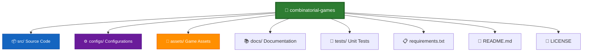
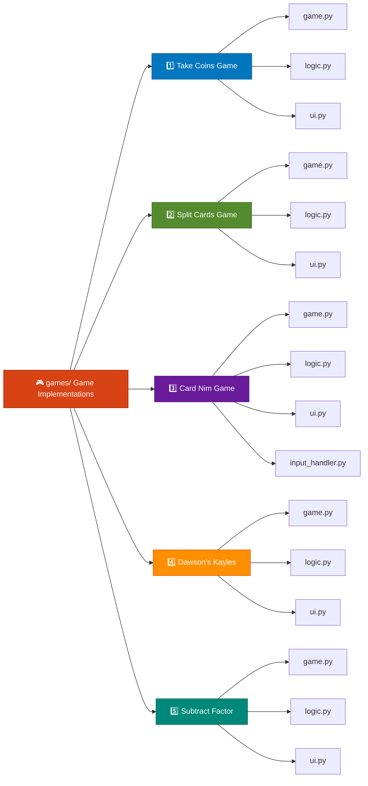
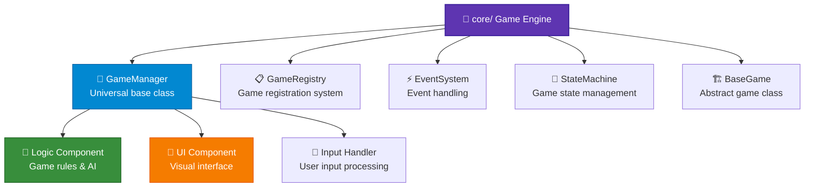
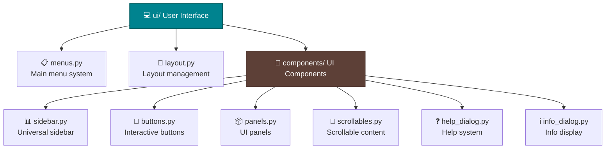
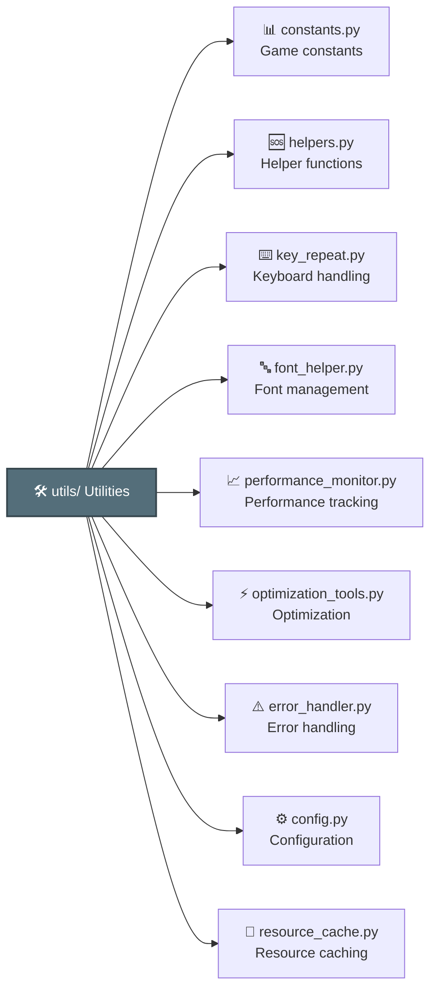
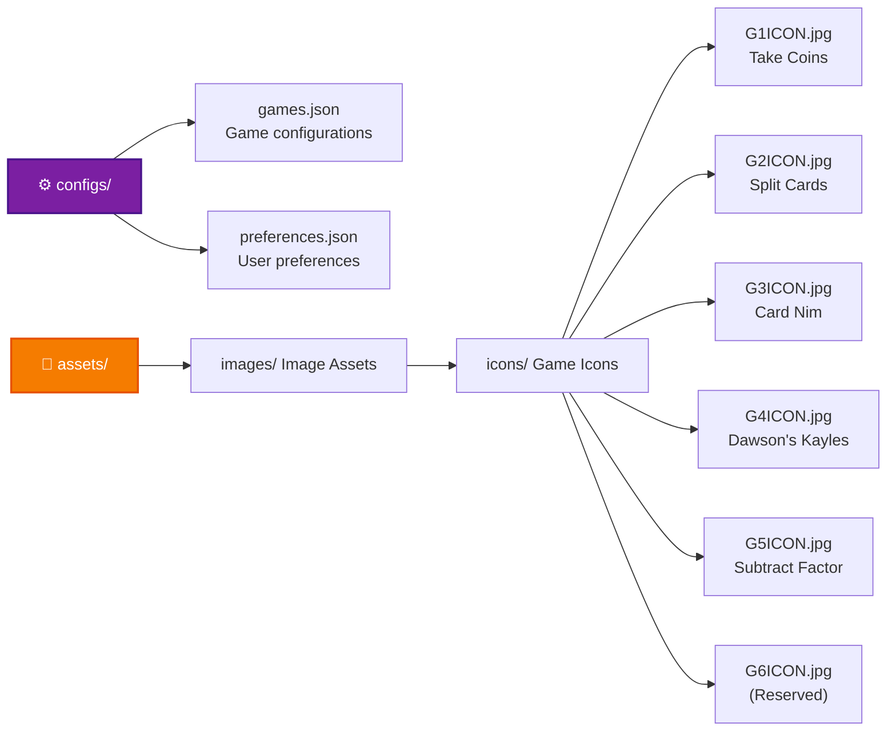

# Combinatorial Game Collection - Pygame Interface

A comprehensive graphical interface for multiple combinatorial mathematical games using Pygame, featuring human vs AI gameplay with strategic decision making.

## TOC
- [Combinatorial Game Collection - Pygame Interface](#combinatorial-game-collection-pygame-interface)
  - [🎮 Games Collection](#🎮games-collection)
    - [1. Take Coins (取硬币游戏)](#1-take-coins取硬币游戏)
    - [2. Split Cards (取卡分堆游戏)](#2-split-cards取卡分堆游戏)
    - [3. Card Nim (卡牌尼姆游戏)](#3-card-nim卡牌尼姆游戏)
    - [4. Dawson's Kayles (道森凯尔斯游戏)](#4-dawson-s-kayles道森凯尔斯游戏)
    - [5. Subtract Factor (因数减法游戏)](#5-subtract-factor因数减法游戏)
  - [🏗️ Project Structure](#🏗️project-structure)
  - [🚀 Installation & Setup](#🚀installation-setup)
    - [Prerequisites](#prerequisites)
    - [Step-by-Step Installation](#step-by-step-installation)
  - [🎯 Features](#🎯features)
    - [Core Gameplay](#core-gameplay)
    - [User Interface](#user-interface)
    - [Technical Features](#technical-features)
  - [🕹️ How to Play](#🕹️how-to-play)
    - [Starting a Game](#starting-a-game)
    - [Universal Controls](#universal-controls)
      - [Mouse Controls](#mouse-controls)
      - [Keyboard Controls](#keyboard-controls)
      - [Sidebar Controls](#sidebar-controls)
    - [Game Flow](#game-flow)
  - [🧠 Mathematical Background](#🧠mathematical-background)
    - [Key Concepts](#key-concepts)
    - [Educational Value](#educational-value)
  - [🔧 Technical Details](#🔧technical-details)
    - [Game Class Architecture](#game-class-architecture)
    - [Performance Features](#performance-features)
  - [🎯 Strategy Tips](#🎯strategy-tips)
    - [General Principles](#general-principles)
    - [Game-Specific Advice](#game-specific-advice)
  - [🐛 Troubleshooting](#🐛troubleshooting)
    - [Common Issues](#common-issues)
    - [Getting Help](#getting-help)
  - [📚 Extending the Collection](#📚extending-the-collection)
    - [Adding New Games](#adding-new-games)
    - [Customization Options](#customization-options)
  - [👥 Contributing](#👥contributing)
    - [How to Contribute](#how-to-contribute)
    - [Contribution Areas](#contribution-areas)
  - [📄 License](#📄license)
    - [Third-Party Assets](#third-party-assets)
  - [🏆 Acknowledgments](#🏆acknowledgments)
    - [Academic Foundations](#academic-foundations)
    - [Technical Foundations](#technical-foundations)
    - [Special Thanks](#special-thanks)

## 🎮 Games Collection

### 1. Take Coins (取硬币游戏)
- **Description**: A mathematical game where players take coins from positions on a line by manipulating adjacent coins.
- **Rules**: Select a non-boundary position, add 1 coin to it while subtracting 1 from both neighbors. A move is valid only if both neighbors have at least 1 coin. The player who cannot make a valid move loses.
- **Mathematical Basis**: Based on impartial combinatorial game theory with linear board configurations.

### 2. Split Cards (取卡分堆游戏)
- **Description**: A card game variant where players can take cards and optionally split remaining piles.
- **Rules**: Players can either take 1 to M cards from a single pile, or split a pile into two non-empty piles. The player who takes the last card wins.
- **Strategy**: Uses Sprague-Grundy theorem for impartial games with splitting moves.

### 3. Card Nim (卡牌尼姆游戏)
- **Description**: A Nim game variant played with card piles instead of traditional objects.
- **Rules**: Multiple piles of cards, players take any number of cards from a single pile. The player who takes the last card wins.
- **Mathematical Basis**: Classic Nim game using binary digital sum (nim-sum) strategy with XOR operations.

### 4. Dawson's Kayles (道森凯尔斯游戏)
- **Description**: A mathematical removal game themed as "Laser Defense System" with towers.
- **Rules**: Players connect adjacent towers with lasers, removing both towers from play. The player who makes the last valid move wins.
- **Strategy**: Uses combinatorial game theory with adjacency constraints and recursive position evaluation.

### 5. Subtract Factor (因数减法游戏)
- **Description**: A mathematical number game where players subtract proper factors from a number.
- **Rules**: 
  - Start with integer n and threshold k (1 ≤ k < n)
  - On each turn: subtract a proper divisor d of current number m (1 ≤ d < m)
  - If result (m - d) < k: current player loses immediately
  - Otherwise: continue with new number
  - Game ends when a player has no valid moves
- **Mathematical Basis**: Combines number theory (divisors) with combinatorial game theory using dynamic programming for winning positions.

## 🏗️ Project Structure

```
combinatorial-games/
├── src/                           # Main source code
│   ├── core/                      # Core game engine
│   │   ├── base_game.py           # Base game class
│   │   ├── game_manager.py        # Universal game manager
│   │   ├── game_registry.py       # Game registration system
│   │   ├── event_system.py        # Event handling system
│   │   └── state_machine.py       # Game state management
│   ├── games/                     # Game implementations
│   │   ├── take_coins/            # Take Coins game
│   │   │   ├── game.py           # Main game class
│   │   │   ├── logic.py          # Game logic
│   │   │   ├── ui.py             # User interface
│   │   │   └── __init__.py
│   │   ├── split_cards/           # Split Cards game
│   │   │   ├── game.py           # Main game class
│   │   │   ├── logic.py          # Game logic
│   │   │   ├── ui.py             # User interface
│   │   │   └── __init__.py
│   │   ├── card_nim/              # Card Nim game
│   │   │   ├── game.py           # Main game class
│   │   │   ├── logic.py          # Game logic
│   │   │   ├── ui.py             # User interface
│   │   │   ├── input_handler.py  # Input handling
│   │   │   └── __init__.py
│   │   ├── dawson_kayles/         # Dawson's Kayles game
│   │   │   ├── game.py           # Main game class
│   │   │   ├── logic.py          # Game logic
│   │   │   ├── ui.py             # User interface
│   │   │   └── __init__.py
│   │   ├── subtract_factor/       # Subtract Factor game
│   │   │   ├── game.py           # Main game class
│   │   │   ├── logic.py          # Game logic
│   │   │   ├── ui.py             # User interface
│   │   │   └── __init__.py
│   │   └── __init__.py
│   ├── ui/                        # User interface components
│   │   ├── components/           # UI components
│   │   │   ├── sidebar.py       # Universal sidebar
│   │   │   ├── buttons.py       # Button components
│   │   │   ├── panels.py        # Panel components
│   │   │   ├── scrollables.py   # Scrollable components
│   │   │   ├── help_dialog.py   # Help dialog
│   │   │   └── info_dialog.py   # Info dialog
│   │   ├── menus.py             # Menu system
│   │   ├── layout.py            # Layout management
│   │   └── __init__.py
│   ├── utils/                    # Utility modules
│   │   ├── constants.py         # Game constants
│   │   ├── helpers.py           # Helper functions
│   │   ├── key_repeat.py        # Keyboard repeat handling
│   │   ├── font_helper.py       # Font management
│   │   ├── performance_monitor.py # Performance monitoring
│   │   ├── optimization_tools.py # Optimization utilities
│   │   ├── error_handler.py     # Error handling
│   │   ├── config.py           # Configuration management
│   │   ├── config_manager.py   # Config file management
│   │   ├── icon_renderer.py    # Icon rendering
│   │   ├── resource_cache.py   # Resource caching
│   │   ├── game_help_content.py # Game help content
│   │   └── __init__.py
│   ├── __init__.py
│   └── main.py                  # Main entry point
├── configs/                     # Configuration files
│   ├── games.json              # Game configurations
│   └── preferences.json        # User preferences
├── assets/                      # Game assets
│   └── images/                  # Image assets
│       └── icons/               # Game icons
│           ├── G1ICON.jpg      # Take Coins icon
│           ├── G2ICON.jpg      # Split Cards icon
│           ├── G3ICON.jpg      # Card Nim icon
│           ├── G4ICON.jpg      # Dawson's Kayles icon
│           ├── G5ICON.jpg      # Subtract Factor icon
│           └── G6ICON.jpg      # (Reserved)
├── requirements.txt             # Python dependencies
├── README.md                    # Project documentation
└── LICENSE                      # MIT License
```







## 🚀 Installation & Setup

### Prerequisites
- Python 3.7 or higher
- Pip package manager
- Git (optional, for cloning)

### Step-by-Step Installation

1. **Clone or Download the Project**
   ```bash
   # Clone from Git
   git clone https://github.com/JieteXue/ICG-Games.git
   cd combinatorial-games
   ```

2. **Install Dependencies**
   ```bash
   pip install -r requirements.txt
   ```
   *Main dependencies include:*
   ```bash
   pip install pygame
   ```

3. **Verify Project Structure**
   Ensure all files are in correct locations as shown in the project structure.

4. **Run the Game**
   ```bash
   # From project root
   python src/main.py
   ```

## 🎯 Features

### Core Gameplay
- **Human vs AI Competition**: Play against intelligent computer opponents
- **Multiple Difficulty Levels**: 
  - Easy (Level 1): AI makes occasional optimal moves
  - Normal (Level 2): Balanced strategic play
  - Hard (Level 3): Mostly optimal play with advanced strategies
  - Insane (Level 4): Near-perfect mathematical play
- **Real-time Game Analysis**: Display current game state, winning/losing positions, and strategic hints
- **Game Mode Selection**: Choose between Player vs Player (PVP) and Player vs AI (PVE)

### User Interface
- **Modern Game Visuals**: Each game has unique visual theme
- **Universal Sidebar**: Consistent navigation across all games
- **Dual Control Schemes**:
  - Mouse: Point-and-click interface with hover effects
  - Keyboard: Quick navigation with arrow keys and shortcuts
- **Game State Tracking**: Current player turn, move history, game status display
- **Responsive Design**: Adapts to different screen sizes and resolutions
- **Interactive Instructions**: In-game help and strategy guides

### Technical Features
- **Modular Architecture**: Easy to add new games with standardized interfaces
- **Mathematical Integration**: Built-in game theory algorithms for optimal play
- **Performance Optimization**: Efficient rendering and memory management
- **Error Handling**: Robust error recovery and user-friendly error messages
- **Extensible Design**: Support for adding new features and customizations

## 🕹️ How to Play

### Starting a Game
1. Run `python src/main.py`
2. Select your desired game from the main menu
3. Choose game mode: PVP (Player vs Player) or PVE (Player vs AI)
4. If PVE, select difficulty level (1-4)
5. Begin playing!

### Universal Controls

#### Mouse Controls
- **Left Click**: Select game elements (coins, cards, towers, factors)
- **Button Clicks**: Interact with UI buttons
- **Mouse Wheel**: Scroll through elements in games with many positions
- **Hover Effects**: Visual feedback on interactive elements

#### Keyboard Controls
- **Arrow Keys**:
  - ↑/↓: Navigate or adjust values (game-dependent)
  - ←/→: Select between different game elements
- **Enter/Return**: Confirm your move
- **R**: Restart current game
- **I**: Show game instructions
- **F2**: Toggle performance overlay
- **ESC**: Return to previous menu or close game

#### Sidebar Controls
- **← Back**: Return to mode selection
- **🏠 Home**: Return to main menu
- **↻ Refresh**: Restart current game
- **i Info**: Show game instructions
- **⚙ Settings**: Game settings (future feature)

### Game Flow
1. **Player Turn**: 
   - Select game elements (varies by game)
   - Adjust parameters if needed
   - Confirm your move
2. **AI Turn**: 
   - Watch AI make strategic move
   - Analyze AI's strategy from move history
3. **Continue** alternating turns until game completion
4. **Victory**: 
   - Most games: Last player to make a valid move wins
   - Some games: Specific winning conditions (check game rules)

## 🧠 Mathematical Background

All games are based on combinatorial game theory principles:

### Key Concepts
- **Impartial Games**: Same moves available to both players
- **Normal Play**: Last move wins convention (misère variants possible)
- **Sprague-Grundy Theorem**: Every impartial game is equivalent to a Nim heap
- **Grundy Numbers**: Numerical values assigned to game positions
- **Nim-Sum**: XOR operation used to determine winning strategies in Nim variants
- **Winning/Losing Positions**: Positions from which current player can force win/loss

### Educational Value
- Learn mathematical game theory through interactive play
- Understand concepts like Sprague-Grundy theorem in practice
- Develop strategic thinking and pattern recognition skills
- Explore computational complexity in game decision-making
- Study number theory applications in Subtract Factor game

## 🔧 Technical Details

### Game Class Architecture
Each game implements a standard interface:
- **GameManager Base Class**: Provides common functionality for all games
- **Logic Component**: Handles game rules, move validation, and AI
- **UI Component**: Manages rendering, layout, and visual effects
- **Input Handler**: Processes user input with keyboard repeat support

### Performance Features
- **Efficient Rendering**: Optimized Pygame drawing operations
- **Memory Management**: Smart caching of game assets
- **Event Handling**: Non-blocking input processing
- **Dynamic Loading**: Games loaded on demand to reduce startup time

## 🎯 Strategy Tips

### General Principles
1. **Learn the Patterns**: Each game has characteristic winning positions
2. **Think Ahead**: Consider multiple moves in advance
3. **Force Opponent Mistakes**: Create positions where all moves lead to losing outcomes
4. **Practice**: Start with easier difficulties to understand game mechanics

### Game-Specific Advice
- **Take Coins**: Control center positions, watch boundary constraints
- **Card Nim**: Master nim-sum (XOR) calculations, aim for zero-sum positions
- **Split Cards**: Balance taking vs splitting, consider SG values of pile sizes
- **Dawson's Kayles**: Create isolated towers, control move sequencing
- **Subtract Factor**: Memorize prime numbers, avoid moves that approach threshold

## 🐛 Troubleshooting

### Common Issues

**Game won't start:**
- Ensure Python 3.7+ is installed: `python --version`
- Verify pygame is installed: `python -m pygame.version`
- Check all required files are in correct directories
- Ensure working directory is project root

**Import errors:**
- Confirm Python path includes `src/` directory
- Verify all `__init__.py` files exist
- Check for circular imports in game modules

**Display issues:**
- Update graphics drivers
- Try running in windowed mode
- Check display resolution and scaling settings
- Verify pygame display initialization

**Performance issues:**
- Close other applications to free memory
- Reduce screen resolution if needed
- Check for background processes consuming resources

### Getting Help
1. Check console for error messages and tracebacks
2. Verify file locations match project structure
3. Ensure all dependencies are installed correctly
4. Consult game rules in instructions for gameplay understanding
5. Check existing issues or create new issue in repository

## 📚 Extending the Collection

### Adding New Games
1. Create new directory in `src/games/`
2. Implement required components:
   - `game.py`: Main game class extending `GameManager`
   - `logic.py`: Game rules and AI logic
   - `ui.py`: Visual interface and rendering
3. Register game in `game_registry.py`
4. Add game icon in `assets/images/icons/`
5. Test thoroughly with various game states

### Customization Options
- Modify difficulty curves and AI behavior
- Add new visual themes and color schemes
- Implement additional game variants or rule modifications
- Create tutorial modes with guided gameplay
- Add sound effects and background music

## 👥 Contributing

We welcome contributions to enhance the game collection:

### How to Contribute
1. Fork the repository
2. Create a feature branch: `git checkout -b feature/new-game`
3. Implement changes with proper testing
4. Follow existing code style and documentation practices
5. Submit a pull request with clear description

### Contribution Areas
- **New Games**: Add more combinatorial games
- **AI Improvements**: Enhance computer opponent algorithms
- **UI Enhancements**: Improve user interface and experience
- **Bug Fixes**: Identify and fix issues
- **Documentation**: Improve guides, tutorials, and comments
- **Localization**: Translate to other languages
- **Performance**: Optimize code and resource usage

## 📄 License

This project is licensed under the MIT License - see the [LICENSE](LICENSE) file for details.

### Third-Party Assets
- Game icons are original or appropriately licensed
- Pygame library under LGPL license
- All code is original work unless otherwise noted

## 🏆 Acknowledgments

### Academic Foundations
- Based on classical combinatorial game theory research
- Inspired by mathematical puzzle collections and competition problems
- Educational value for game theory and discrete mathematics

### Technical Foundations
- Built with Pygame community resources and documentation
- Leverages Python's mathematical and scientific computing ecosystem
- Inspired by open-source game development projects

### Special Thanks
- Contributors who have added games and features
- Testers who provided feedback and bug reports
- Mathematics educators who suggested improvements

---

**Enjoy exploring the fascinating world of mathematical games! 🎲**

*Project maintained by combinatorial game enthusiasts*  
*Last updated: December 2025*